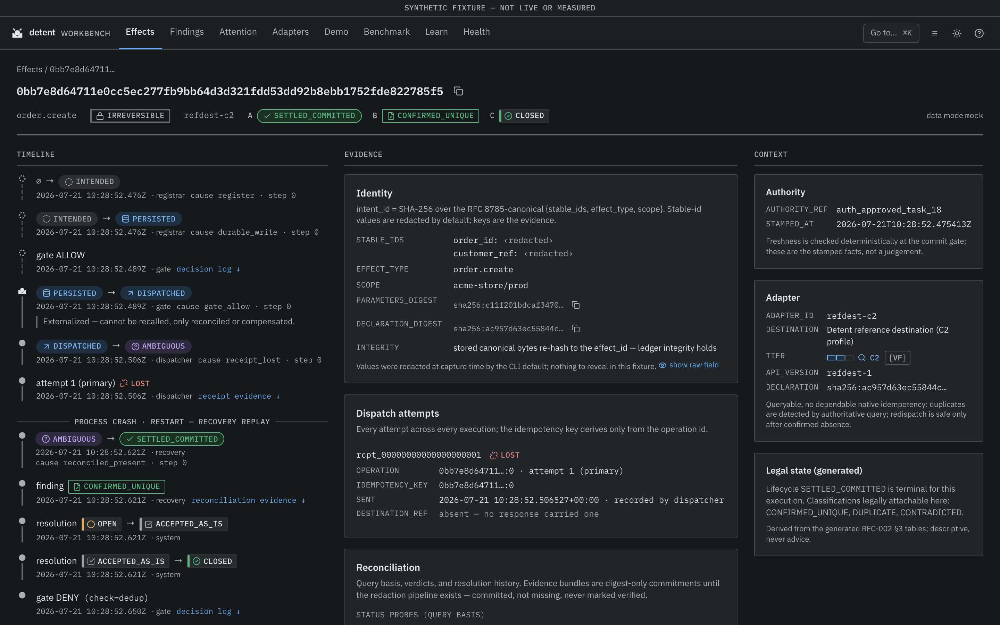
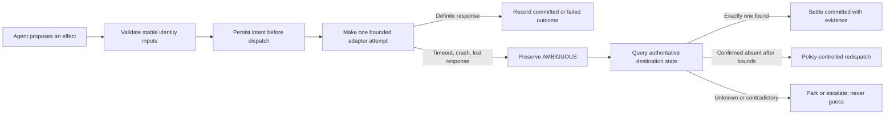

<p align="center">
  
</p>

# Irrevon

**Evidence-first reconciliation for irreversible AI-agent actions.**

[](https://github.com/PranavMishra28/irrevon/actions/workflows/ci.yml)
[](pyproject.toml)
[](LICENSE)
[](docs/execution-plan.md)

An agent asks an API to create a payment, shipment, order, or booking. The
destination commits, the response disappears, and the agent cannot know whether
retrying will duplicate the real-world effect. Irrevon persists intent before
dispatch, makes ambiguity explicit, and reconciles against destination evidence
instead of guessing.

> **Current status:** public Apache-2.0 `v0.1.0` alpha candidate, not a
> published release. The engine,
> continuous single-writer worker, local read-only Workbench, deterministic
> demo, benchmark development harness, and package build are implemented.
> Development evidence is synthetic. The preregistration is an unfrozen draft,
> there are no confirmatory results, and the Stripe/EasyPost adapters are drafts
> that have never been live-called. Nothing has been published to PyPI.
>
> The configured [public site](https://irrevon.vercel.app/) is not the current
> source of truth: its observed content matches the July 22 pre-main build and
> `/version.json` is absent. That observation does not cryptographically identify
> its deployed commit. Use this repository until the owner redeploys and verifies
> the production alias.

## Quickstart

You do **not** need a hosted Postgres account. The demo uses the digest-pinned
PostgreSQL 17 container in this repository and binds it only to loopback.

Prerequisites: [uv](https://docs.astral.sh/uv/), Docker with Compose, and Git.
Viewing the source-built Workbench additionally requires Node 24 and Corepack.

```bash
git clone https://github.com/PranavMishra28/irrevon.git
cd irrevon

uv sync --locked
uv run irrevon init
cp .env.example .env
set -a && . ./.env && set +a
docker compose up -d --wait
uv run irrevon init
uv run irrevon doctor
uv run irrevon demo --seed 42 --keep \
  --artifact ./irrevon-demo-artifact.json
```

`doctor` is non-destructive but not strictly read-only: it performs a
rolled-back temporary-table write probe using the runtime/operator role.

The demo deliberately loses a committed response, kills the engine process,
restarts it, reconciles by destination read-back, and rejects a re-synthesized
duplicate. It also runs a conventional durable-retry contrast against the same
synthetic C2 destination. This is a deterministic development demonstration,
not a benchmark result.

Explore the recorded evidence:

```bash
corepack enable
make web-build dist-stage
uv run irrevon serve \
  --dsn postgresql://irrevon_app@localhost:5432/irrevon_demo_s42 \
  --demo-artifact ./irrevon-demo-artifact.json \
  --open
```

`make web-build dist-stage` builds the React Workbench and stages it into the
source package before `serve` starts. The `--dsn` selects the kept seed-42 demo
database; `--demo-artifact` hands the exact event transcript and summary to the
Workbench. The demo prints an equivalent evidence-specific command after every
successful run.

`irrevon serve` listens only on `127.0.0.1`, implements GET/HEAD only, connects
as a SELECT-only database role, and returns digests rather than raw upstream
stable-identifier values. The CLI can reveal those values only through the
explicit local `irrevon inspect --reveal` option.

[Recorded demo artifacts](site/src/data/demo) ·
[Getting started](site/src/content/guides/getting-started.md) ·
[Operations](docs/operations.md) ·
[Current status](docs/project-status.md) ·
[Discoverability and launch measurement](docs/discoverability.md)



The screenshot is generated from schema-validated synthetic fixtures.

## The failure Irrevon addresses

```text
request sent → destination commits → response is lost → caller retries
```

Ordinary techniques solve adjacent problems but cannot always answer the
post-crash question:

- A request hash identifies request bytes, not necessarily one business intent.
- A fresh UUID changes when an agent reconstructs a tool call.
- A provider idempotency key helps only when the provider supports it for the
  operation, retains it long enough, and applies the expected semantics.
- A durable workflow can retry reliably while still duplicating a C2
  destination that does not deduplicate.
- An outbox proves the intent was handed off; it does not prove what an external
  destination committed after a lost response.

Irrevon combines those patterns where useful. It adds stable business-intent
identity, persist-before-dispatch evidence, explicit ambiguity, and
capability-bounded destination reconciliation.

## How it works



Three rules are load-bearing:

1. **Identity comes from stable business facts.** `effect_id` is derived from
   the RFC 8785 canonical form of `{stable_ids, effect_type, scope}`, not model
   prose or a regenerated UUID.
2. **Intent exists before the external effect.** The append-oriented PostgreSQL
   ledger records the possibility of an effect before an adapter crosses the
   irreversible boundary.
3. **The destination is authoritative.** Recovery asks what actually happened
   when the destination exposes a suitable read path; it does not infer success
   or safety from a missing response.

## Capability boundary

| Tier | Destination capability | Honest boundary |
|---|---|---|
| **C1** | Dependable native idempotency | Use it. Irrevon adds evidence and comparison but pre-commits to no duplicate-prevention advantage. |
| **C2** | No dependable idempotency, but authoritative status is queryable | Irrevon's primary scope: reconcile before any policy-controlled redispatch. |
| **C3** | Neither dependable identity nor authoritative query | The outcome may be unknowable for every client-side method; Irrevon preserves that uncertainty. |

Irrevon does **not** guarantee universal exactly-once execution, turn
compensation into rollback, or make an incapable destination knowable.

## What exists today

| Surface | Implemented | Important limit |
|---|---|---|
| Engine | Identity, registrar, append-oriented ledger, gate, dispatcher, reconciliation, recovery, sweep, auditor | One active writer; not a hosted service |
| Worker | Continuous recovery/reconciliation/sweep loop, writer exclusion, graceful termination, health artifact | Multi-writer leasing and horizontal HA are not implemented |
| Workbench | Read-only fixture/live evidence UI, causal history, findings, adapter and health views | Loopback-only; no mutations or remote auth |
| IrrevonBench | Development fixtures, fault schedules, baselines, causal-history oracle, metrics, statistics, integrity refusals | No freeze, confirmatory run, result, or independent reproduction |
| Adapters | Reference C1/C2/C3 plus draft Stripe C1 and EasyPost C2 code under synthetic transports | Provider drafts are not qualified and reject production credentials |
| Distribution | Wheel/sdist build, exact-content check, clean-install smoke test | `irrevon` is not published on a package index |
| Site | Static Astro product/docs build with claims registry and accessibility/link tests | Deployment state is owner-controlled |

The machine-readable source of current release truth is
[`docs/project-status.json`](docs/project-status.json), checked by
`make public-truth`.

## Integration model

The Python engine is the authority surface. A host application supplies an
`IntentContract` containing stable identifiers, effect type, scope, adapter,
parameters, and upstream authority evidence. The engine:

1. validates and registers the intent;
2. derives the stable effect identity;
3. records a gate decision;
4. claims one dispatch attempt;
5. records a complete, failed, timeout, or lost receipt;
6. reconciles ambiguous executions using the adapter declaration.

Start with the [integration guide](site/src/content/guides/integration.md) and
[adapter-development guide](site/src/content/guides/adapter-development.md).
Machine-readable contracts live in [`schemas/`](schemas/README.md).

Provider behavior is never inferred from a mock. Declarations distinguish
cited assumptions, synthetic contract coverage, and future observed evidence.
Real provider use remains blocked on owner-approved terms review and bounded
sandbox spikes.

## Evaluated deployment boundary

The implemented components fit a deliberately small self-hosted topology:

```text
host application → one Irrevon writer/worker → PostgreSQL 17
                              ↓
                    configured destinations

operator browser → 127.0.0.1 irrevon serve → SELECT-only ledger session
```

It is self-hosted, one-active-writer, operator-monitored, and designed for a
local read-only Workbench. Operators own PostgreSQL backups/PITR, secrets,
process supervision, capacity, retention, and provider configuration. See
[operations](docs/operations.md).

This is an evaluated component boundary, not yet a supported production
deployment profile. The standalone worker has no registration/dispatch ingress;
an embedded host engine and the worker cannot both own the single-writer lock.
That topology decision, a fresh-cluster restore proof, durable sweep catch-up,
and production supervisor/container artifacts must close before production
support is claimed.

## Benchmark and scientific limits

IrrevonBench is designed to be able to falsify Irrevon's proposed advantage.
The harness preserves invalid runs, separates subject accounting from scoring,
cross-checks destination read-back with causal histories, and refuses
confirmatory mode until machine-verifiable human freezes exist.

Public development fixtures and the flagship demo are **synthetic**. No
headline result, customer result, provider result, scientific validation,
independent review, or production evidence exists. Read the
[benchmark methodology](docs/benchmark.md), [draft preregistration](docs/benchmark-preregistration.md),
and [publishing policy](bench/PUBLISHING.md).

## Security and privacy

The core threat is false certainty around irreversible effects. Controls
include:

- persist-before-dispatch ordering and one wire attempt per dispatch claim;
- strict schemas and unknown-field rejection at trust boundaries;
- fail-closed response classification and bounded HTTP operations;
- append-oriented evidence and locked database transition functions;
- default identifier digestion on the loopback Workbench surface;
- no CLI telemetry, update checks, crash reporting, or external browser assets;
- sandbox/test credential gates on draft provider adapters;
- full-history secret scanning, SHA-pinned Actions, dependency review, and
  non-publishing release attestations/SBOM preparation.

Do not put production payloads, credentials, or private identifiers in public
issues or fixtures. Report vulnerabilities privately as described in
[SECURITY.md](SECURITY.md).

## Community and support

GitHub Discussions is currently disabled, so no Discussion or category link is
exposed. Public [issues](https://github.com/PranavMishra28/irrevon/issues)
remain the intake for bugs, documentation problems, benchmark-integrity
reports, and scoped proposals—not general support or open-ended conversation.

> **Owner-only Discussions gate:** before exposing any Discussion link, enable
> Discussions; create or verify `Announcements`, `Q&A`, `Ideas and feedback`,
> and `Show and tell`; publish and pin a welcome post; and read back every
> category URL.

Never file a vulnerability publicly. Use
[GitHub private vulnerability reporting](https://github.com/PranavMishra28/irrevon/security/advisories/new).
Support is best-effort with no response SLA; see [SUPPORT.md](SUPPORT.md).

## Contributing

Contributions are welcome under inbound-equals-outbound Apache-2.0 with a
Developer Certificate of Origin (DCO) 1.1 sign-off on every commit. There is no
CLA.

```bash
git commit -s -m "your change"
make check
```

Read [CONTRIBUTING.md](CONTRIBUTING.md), [GOVERNANCE.md](GOVERNANCE.md), and
[CODE_OF_CONDUCT.md](CODE_OF_CONDUCT.md). Public issue forms distinguish bugs,
documentation, scoped proposals, and benchmark-integrity concerns.

## Repository map

```text
src/irrevon/       engine, CLI, worker, adapters, benchmark harness
migrations/        PostgreSQL roles, tables, transitions, and read grants
schemas/           thirteen machine-readable trust-boundary contracts
tests/             unit, property, process, integration, security, and E2E
bench/             synthetic development fixtures and benchmark policies
web/               React/Vite read-only Workbench
site/              Astro product and documentation site
docs/              architecture, operations, benchmark, decisions, roadmap
scripts/           integrity, privacy, packaging, release, and launch gates
.github/            CI, security, contribution, and release automation
```

The state model is encoded once in `src/irrevon/statetable.py`. The
hash-pinned [master document](docs/master-doc.md) preserves product authority;
the [ADR index](docs/decisions/README.md) records decisions; historical task and
planning records are not required reading for normal use.

## Development and verification

```bash
make check             # deterministic docs, schemas, security, truth, integrity
make py-check py-test  # lint, types, import boundaries, unit/property tests
make check-all         # full Python/Postgres/Workbench/site routine ladder
make dist-smoke        # wheel + sdist exact-content and clean-install proof
make launch-audit      # non-publishing launch, package, privacy, release audit
```

CI maps every job to a named `make` target. Ordinary merges publish and deploy
nothing. The future release flow requires a human-pushed version tag, protected
environment approval, tag/version match, full validation, clean builds,
checksums, SBOM, GitHub attestations, and PyPI Trusted Publishing without a
long-lived token. See [CI](docs/ci.md) and
[release process](docs/release-process.md).

## License

Apache License 2.0. See [LICENSE](LICENSE), [NOTICE](NOTICE),
[LICENSING.md](LICENSING.md), and
[THIRD-PARTY-NOTICES.md](THIRD-PARTY-NOTICES.md).
