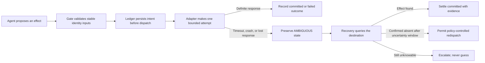

# Irrevon

**Evidence-first handling for irreversible AI-agent actions.**

Irrevon combines two things:

1. **IrrevonBench** — a fault-injection benchmark for measuring duplicate, orphaned,
   and lost external effects.
2. **Irrevon** — a reference reconciliation engine that persists intent before dispatch,
   derives identity from stable business facts, and resolves ambiguous outcomes by querying
   the destination.

An AI agent can time out after a payment, order, or booking has already committed. A blind
retry can repeat the effect; assuming success can lose it. Irrevon makes that uncertainty a
durable, inspectable state instead of silently guessing.

> [!IMPORTANT]
> This is a **research preview**, not released production software. The core engine,
> continuous single-writer worker, local read-only Workbench, benchmark foundation, and
> deterministic flagship demo are implemented. The benchmark preregistration is still a
> draft; public development fixtures are synthetic; provider adapters are credential-gated
> drafts that have never been live-called; and no package has been published.

[Run the demo](#quickstart) · [Understand the mechanism](#how-it-works) ·
[Explore the repository](#repository-map) ·
[Read the benchmark plan](docs/benchmark.md) ·
[See the release gates](docs/execution-plan.md)

---

## The problem

Suppose an agent asks an external API to create an order:

```text
request sent → destination commits → response is lost → agent retries
```

The caller cannot infer whether the first attempt committed from the missing response.
Model-generated retries make the problem worse: wording and incidental fields can change
even when the underlying business operation is identical. A fresh UUID or an idempotency
key derived from the regenerated request therefore may not identify the same real-world
effect.

Irrevon is built around a narrower, honest goal:

- identify an intended effect from stable upstream business identifiers;
- durably record that intent before any external call;
- preserve ambiguity when the outcome is unknown;
- reconcile by authoritative destination read-back where the destination permits it;
- reject or surface duplicates with evidence;
- measure where the method works, adds nothing, or is impossible.

It does **not** claim universal exactly-once execution. It does **not** call compensation
rollback. Its guarantees are bounded by destination capabilities.

## How it works



Three design choices carry the system:

### 1. Identity comes from business facts

An effect ID is derived from stable fields such as tenant, effect type, order ID, or invoice
ID—not from model prose. Two differently worded attempts for the same business operation
collapse to the same identity.

### 2. Intent is persisted before dispatch

The ledger records what may happen before the adapter crosses the irreversible boundary.
A crash before the record exists is effect-free; a crash after it exists leaves evidence
for recovery.

### 3. Recovery asks the destination

After an ambiguous result, the engine does not trust the caller’s belief and does not
automatically retry. It queries authoritative destination state when available, accounts
for consistency windows, and keeps unknown outcomes explicit.

## Capability tiers

| Tier | Destination capability | Honest system boundary |
|---|---|---|
| **C1** | Dependable native idempotency | The destination already prevents duplicates; Irrevon pre-commits to no benchmark advantage. |
| **C2** | No dependable idempotency, but authoritative status is queryable | Reconciliation can detect committed effects and may permit redispatch only after confirmed absence. This is Irrevon’s primary scope. |
| **C3** | No dependable key and no authoritative query | Lost and orphaned effects are unknowable for every client-side method. Irrevon exposes this impossibility boundary. |

## What is implemented

| Surface | What exists today | Evidence / boundary |
|---|---|---|
| Core engine | Identity, ledger, gate, dispatcher, reconciliation, recovery, sweep, auditor | [RFC-002](docs/rfc-002-engine-design.md), `src/irrevon/`, `tests/` |
| Flagship demo | Real Postgres, deterministic C2 destination, lost response, actual SIGKILL, restart, reconciliation, and B5 contrast | `uv run irrevon demo`; synthetic reference destination |
| Worker | Continuous single-writer reconciliation/sweep loop, writer-lock exclusion, graceful shutdown, freshness health file | [Operations guide](docs/operations.md); multi-writer is designed, not implemented |
| IrrevonBench | Contracts, fault orchestration, baseline registry, two-oracle scoring, statistics pipeline, deterministic public dev fixtures | [Benchmark guide](docs/benchmark.md); no confirmatory results |
| Workbench | Local-first, read-only evidence UI with fixture and loopback live modes | [web/README.md](web/README.md); no mutation API |
| Marketing/docs site | Static Astro site, rendered docs, search, recorded demo, claims registry, SEO, CSP, accessibility tests | [site/README.md](site/README.md); deployment is owner-controlled |
| Packaging | Wheel and sdist build plus isolated install smoke test | Built locally; unpublished |
| Provider adapters | Draft Stripe C1 and EasyPost C2 adapters with sandbox-key gates and synthetic transports | Never live-called; ADR-0010/0012 and provider/ToS review remain human gates |

### Workbench

The Workbench keeps lifecycle, classification, and resolution separate and connects every
operator-facing conclusion to recorded evidence. Fixture and live modes are visibly
different and cannot be mixed.


The screenshot uses schema-validated synthetic fixtures captured from the reference engine.
The Workbench can also read from `irrevon serve`, a loopback-only GET/HEAD surface backed by
a SELECT-only database role.

## The flagship demonstration

`irrevon demo` runs the same fault schedule through two legs:

1. **Irrevon leg.** The intent is persisted, the destination commits, the response is
   deliberately lost, and the engine process is SIGKILLed. On restart, recovery queries
   before redispatch, finds the effect, settles it with evidence, and rejects a
   re-synthesized duplicate. The destination contains one effect.
2. **B5 contrast leg.** A durable conventional runtime retries with an idempotency key, but
   the C2 reference destination does not honor that key. The destination contains two
   effects.

This is a deterministic development artifact, not a scientific benchmark result. The demo
fails if the expected contrast disappears; the benchmark is not designed so Irrevon must
win.

## Quickstart

Prerequisites:

- [uv](https://docs.astral.sh/uv/)
- Docker with Compose
- Git

No hosted Postgres account is required. The initializer creates a digest-pinned Postgres 17
Compose service bound to loopback.

```bash
git clone <repository-url>
cd irrevon

uv sync --locked
uv run irrevon init
cp .env.example .env
docker compose up -d --wait

# Re-run after Postgres is ready so migrations are applied.
uv run irrevon init
uv run irrevon doctor
uv run irrevon demo
```

The generated `.env` example contains a local placeholder only. Never commit a real
credential.

Useful commands:

```bash
uv run irrevon --help
uv run irrevon worker --help
uv run irrevon serve --help
uv run irrevon bench --help
uv run irrevon inspect <effect_id> --dsn '<dsn printed by the demo>'
```

Confirmatory benchmark mode intentionally refuses to run until the human-owned freeze
registrations verify. Provider adapters also refuse live-mode credentials.

## Product surfaces

### CLI and engine

The Python package is the system of record. It owns identity, transitions, reconciliation,
adapter registration, migrations, the worker, the benchmark harness, and inspection
commands.

### Read-only Workbench

`web/` is a React/Vite application for investigating effects and findings. It consumes
either checked-in fixtures or the loopback read server. It cannot dispatch, reconcile,
adjudicate, or mutate ledger state.

### Marketing and documentation site

`site/` is an Astro static site with a drift-gated claims registry, repository-doc mirrors,
self-hosted search, a recorded interactive demo, source-linked claims, SEO metadata,
security headers, and automated accessibility checks. Its deployment is intentionally a
human action.

### Benchmark

The benchmark harness separates public development fixtures from future confirmatory
evidence, records fault schedules and subject accounting, and cross-checks a destination
read-back oracle with a causal-history oracle. See [docs/benchmark.md](docs/benchmark.md)
and the still-draft [preregistration](docs/benchmark-preregistration.md).

## Repository map

```text
irrevon/
├── src/irrevon/          Python engine, CLI, worker, adapters, benchmark harness
├── migrations/           Plain-SQL ledger schema and locked transition functions
├── schemas/              Machine-readable trust-boundary contracts
├── tests/                Unit, property, process, integration, and flagship E2E tests
├── bench/                Benchmark fixtures, policies, and public development data
├── web/                  Read-only React/Vite Workbench
├── site/                 Astro marketing and documentation site
├── docs/                 Product, RFC, benchmark, operations, CI, and decision records
├── scripts/              Drift, integrity, packaging, and documentation generators
├── tasks/                Bounded implementation records
├── .github/workflows/    CI, nightly, benchmark, sandbox, and release gates
├── Makefile              Canonical local/CI command surface
└── AGENTS.md             Repository map and rules for human/agent work
```

The state machine is defined once in `src/irrevon/statetable.py`; database transitions,
application behavior, schema examples, and tests are checked against that canonical
definition. The immutable product authority is
[docs/master-doc.md](docs/master-doc.md), whose hash is pinned and verified.

## CI/CD and deployment

Every GitHub Actions job body delegates to a named `make` target so local and CI behavior
stay aligned. The workflow tiers are documented in [docs/ci.md](docs/ci.md):

- pull-request gates validate integrity, Python, schemas, Workbench, site, distribution,
  and workflow security;
- nightly jobs run slower reliability and integration checks;
- benchmark, sandbox, release, and site-deploy paths are fail-closed and human-dispatched;
- actions are commit-SHA pinned, secrets are scanned, and generated artifacts are
  drift-checked.

Nothing is automatically published or deployed from an ordinary merge. Postgres is local
by default. The Workbench is built into a static read surface, the marketing site is a
static Vercel package, and Python wheel/sdist artifacts are built and smoke-tested but not
published. Repository settings, credentials, public visibility, live provider calls,
deployments, preregistration freeze, and releases remain owner-controlled.

## Security model

Irrevon assumes external effects are irreversible and external responses may be missing,
late, duplicated, or misleading. Important controls include:

- one attempt per adapter dispatch call;
- fail-closed classification of malformed or ambiguous provider responses;
- sandbox/test credential prefixes for draft provider adapters;
- secrets supplied by environment-variable name, never stored values;
- single-writer advisory locking;
- append-only evidence and transition enforcement in Postgres;
- loopback-only read serving with GET/HEAD and a SELECT-only role;
- dependency and action pinning, secret scanning, workflow linting, and provenance gates.

This is not a security certification. Read [SECURITY.md](SECURITY.md) before reporting a
vulnerability and [docs/security-policy.md](docs/security-policy.md) for the development
threat model.

## Scientific and product limits

- The benchmark preregistration is **draft**; no section is frozen.
- Public benchmark fixtures and disclosed pilot outputs are **developmental/synthetic**.
- There are **no confirmatory benchmark results** yet.
- Draft Stripe and EasyPost adapters use synthetic transports and have never been
  live-called.
- Multi-worker leasing is designed but not implemented; the shipped worker is
  single-writer.
- There is no hosted control plane, SLA, customer claim, pricing, package-index release, or
  accepted outside contribution path.
- C1’s expected null and C3’s impossibility result are first-class outcomes, not failures
  to hide.

The live-provider spikes, independent review, benchmark freeze, name screen, release
artifacts, and publication sequence are tracked in
[docs/execution-plan.md](docs/execution-plan.md) and
[docs/review-queue.md](docs/review-queue.md).

## Licensing

The source tree carries the [Apache License 2.0](LICENSE) and [NOTICE](NOTICE). Apache-2.0
allows use, modification, and redistribution, including commercially, while requiring
license/notice preservation and providing an express patent grant. It does **not** prevent
forks or grant trademark rights.

No outside contributions are accepted while contributor governance remains unresolved.
Nothing in this repository is legal advice; see [LICENSING.md](LICENSING.md),
[THIRD-PARTY-NOTICES.md](THIRD-PARTY-NOTICES.md), and [ASSETS.md](ASSETS.md).

## Validate the repository

```bash
make tools       # one-time checksum/version-verified tool bootstrap
make check       # required deterministic repository gate
make py-check
make py-test
make check-all   # complete local ladder
```

`make check` verifies links, schemas and examples, secret scanning, the master-document
hash pin, ADR uniqueness, generated-file drift, workflow syntax/security, and
frozen/append-only rules. See the [CI guide](docs/ci.md) for the full matrix.

## Reading order

For a complete understanding:

1. [AGENTS.md](AGENTS.md) — source-of-truth map and repository rules.
2. [docs/master-doc.md](docs/master-doc.md) — product intent, invariants, benchmark design,
   and canonical decisions.
3. [docs/rfc-001-first-slice.md](docs/rfc-001-first-slice.md) — first-slice system design.
4. [docs/rfc-002-engine-design.md](docs/rfc-002-engine-design.md) — state, ledger,
   reconciliation, and failure mechanics.
5. [docs/benchmark.md](docs/benchmark.md) — measurement and integrity boundary.
6. [docs/operations.md](docs/operations.md) — running and operating the worker.
7. [docs/ci.md](docs/ci.md) — CI/CD and owner-controlled release/deploy paths.
8. [docs/execution-plan.md](docs/execution-plan.md) — remaining gates.
9. [docs/decisions/README.md](docs/decisions/README.md) — decision index and open ADRs.

The project’s credibility depends on keeping implemented facts, recorded artifacts,
proposed designs, and future claims visibly separate.
