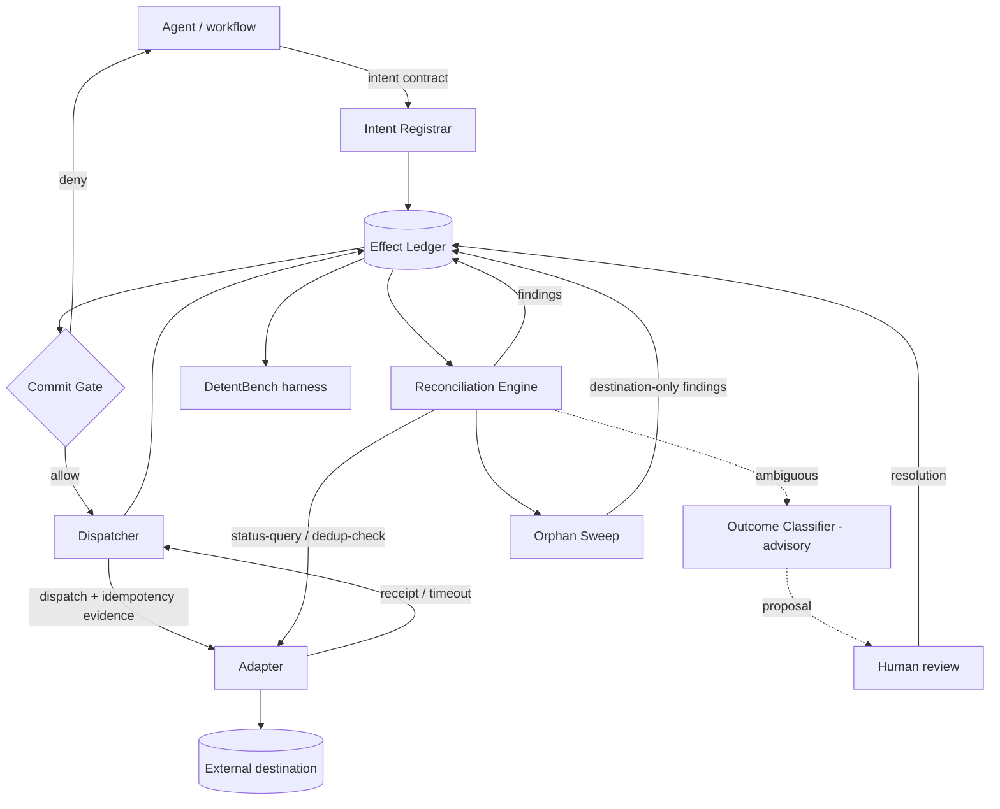
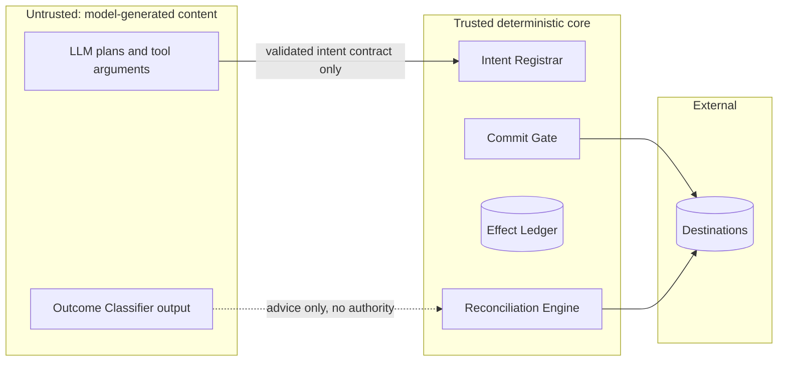
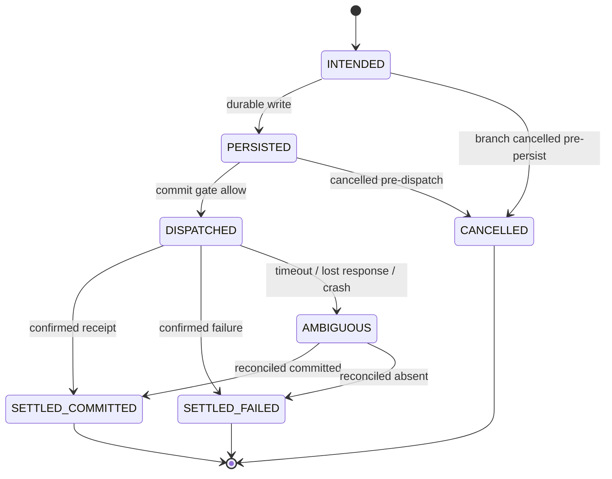
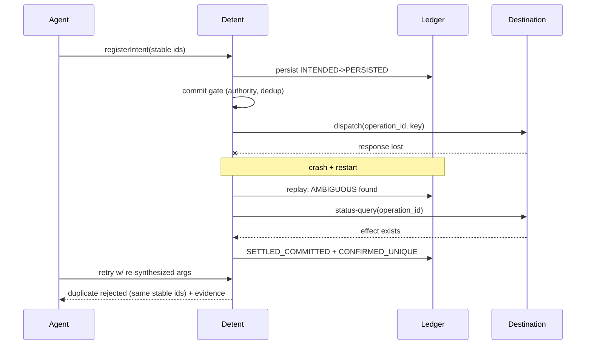

# Detent — Master Project Document

**An open-source benchmark and reference reconciliation engine for honest handling of irreversible AI-agent actions.**

Detent (reference layer) · DetentBench (benchmark) · Statement Autopsy (demo) · Self-contained edition · July 20, 2026

---

## 0. How to Read This Document

This is the single authoritative document for the project. A qualified engineer or reviewer should be able to understand, build, test, operate, and evaluate the project from this file alone, without opening any prior draft. It reads linearly: decision and thesis first, then problem and evidence, the exact contribution, product and architecture, the benchmark, security, build plan, operations, blockers, and next actions.

**Epistemic labels are used deliberately.** `[VF]` verified fact (cited external source), `[EI]` evidence-backed inference, `[TH]` testable hypothesis, `[DD]` design decision internal to the project, `[OQ]` unresolved open question. A claim without a label is a design decision.

**Traceability** runs claim → evidence → requirement → design decision → invariant → test → metric → success/kill. Section 7 guarantees map to Section 8 benchmark metrics and Section 12 conformance tests; Section 11 decisions carry alternatives and reopen triggers.

**Deliberately excluded** and deferred to separate companion documents (see Section 17): visual branding, logos, social strategy, launch timing, promotional copy, and detailed distribution work.

---

## 1. Decision and Thesis

### 1.1 Independent verdict

**Build it — but benchmark-first and scoped to the C2 destination class — as an open-source reliability contribution, not a startup. Confidence ~70%.**

The project survived adversarial revalidation with one material reframe: **lead with the benchmark, not the runtime.** The earlier design over-weighted the reconciliation library, which is thin per-destination and easy for an incumbent (a durable-execution vendor or an agent framework) to absorb. A credible, contamination-resistant benchmark is hard to absorb, is the durable asset, and is the artifact that best signals agent-reliability competence to teams that hire for it.

**The single decisive reason:** after the strongest baselines (stable workflow-issued operation IDs + destination-native idempotency + durable execution), the residual technical gap is narrow and lives almost entirely on **C2 destinations** — those that expose authoritative status but lack dependable idempotent execution. That gap is real and populated by high-volume APIs, but it is not large enough to justify a runtime or a company. It is large enough to justify a benchmark that measures it and a reference engine that closes it.

### 1.2 Precise thesis

**Technical question (frozen):** When an LLM agent crosses into an irreversible external action and the outcome is ambiguous — a lost response, a crash mid-call, or a re-synthesized retry with different arguments — how often do duplicate, orphaned, or lost effects actually occur against real production API contracts, and how much of that can a deterministic reconciler eliminate or surface without the agent's cooperation?

**Claim** `[TH]`**:** A deterministic layer that (1) keys effect identity on stable business identifiers rather than model-generated arguments, (2) persists intent before dispatch, and (3) reconciles ambiguous outcomes by querying the destination's authoritative status will measurably reduce duplicate, orphaned, and lost-legitimate effects **on C2 destinations** — and will show **no advantage** over native idempotency on C1 destinations. The project commits in advance to reporting the null (the second half) as prominently as any positive result.

### 1.3 What the adversarial revalidation changed

- **Benchmark-first, not runtime-first.** The benchmark is the durable, hard-to-absorb asset and the career signal; the reference engine is the "proposed system" baseline within it. `[EI]`
- **Scoped tightly to C2.** C1 is solved by native idempotency; C3 is an impossibility boundary you can only demonstrate. The defensible contribution lives on C2. `[VF]`
- **Reframed from "frequent" to "high-severity, low-frequency."** Anthropic's measurement (below) shows irreversible actions are rare as a share of traffic; the value proposition is per-incident severity, which favors a reliability/benchmark artifact over a metered always-on product. `[VF]`
- **Named the real C2 APIs** (Amadeus, Twilio, EasyPost, Shippo, Shopify `orderCreate`) so the wedge is concrete and falsifiable, not asserted. `[VF]`

---

## 2. Problem and Why Now

### 2.1 The problem

LLM agents are non-deterministic; the side effects they trigger are not. When an agent crashes mid-run, retries a timed-out call, or re-synthesizes its arguments after a context reset, it can charge a card twice, book the wrong slot, or leave an orphaned order no process reconciles. Durable-execution engines give exactly-once replay only against resources they control and hand the external-API problem back to the developer via idempotency keys. "Just use idempotency keys" solves the simple lost-response case, but it fails in two agent-specific ways: the key is often derived from model-generated arguments that change on retry, and it cannot recover an effect the system never recorded.

### 2.2 Evidence (primary sources)

- **The failure mode is agent-specific and documented across frameworks.** `[VF]` ACRFence (arXiv 2603.20625) documents "semantic rollback attacks": under temperature 0, floating-point nondeterminism yields different token sequences on retry, so a re-synthesized tool call carries a different reference ID and the destination treats it as new — defeating idempotency keys, recorded-nondeterminism, and deterministic orchestrators, all of which assume the caller resends an identical request. Its survey of 12 frameworks found none enforce exactly-once at the tool boundary, and a LangGraph maintainer confirmed the re-execution problem is architecturally difficult to fix.
- **Duplicate-execution issues recur across production frameworks.** `[VF]` Open issues in LangGraph and CrewAI document tool re-execution on retry firing duplicate payments/emails; two independent parties confirmed the same failure mode.
- **The distinction from ordinary retry duplication is the crux.** `[EI]` Classic distributed systems assume a deterministic caller; the agent breaks that assumption by regenerating the request itself. This is why arg-hash dedup and caller-supplied idempotency keys are insufficient in the ambiguous case.

### 2.3 Honest counter-evidence

- **Irreversible actions are rare as a share of traffic.** `[VF]` Anthropic's "Measuring AI agent autonomy in practice" (Feb 18, 2026), from a sample of 998,481 random tool calls, found ~73% of tool calls come from agents with a human in the loop in some way and **only ~0.8% of actions appear to be irreversible.** This is the strongest counter-evidence: the problem is high-severity, low-frequency. It argues for a reliability/benchmark artifact, not a metered runtime.
- **Native idempotency is spreading in payments.** `[VF]` Stripe/OpenAI's Agentic Commerce Protocol pushes native idempotency for payments, steadily shrinking the C1 problem. It is *not* spreading in travel, logistics, messaging, or commerce order-creation — which is exactly where C2 lives.

### 2.4 Why now

Agents crossed into the write path in 2025–26; card networks activated agent payments while keeping the merchant as merchant of record. Benchmark credibility is simultaneously in crisis (Section 8.1), which makes a rigorously preregistered benchmark unusually valuable right now.

---

## 3. Users, Buyer, Workflow and Business Hypothesis

### 3.1 Users and buyer

| Party                  | Description                                                                                                                                                                                   |
| ---------------------- | --------------------------------------------------------------------------------------------------------------------------------------------------------------------------------------------- |
| Primary user           | Engineers building production agents that take irreversible third-party-API actions (orders, bookings, shipments, messaging).                                                                 |
| Secondary user         | Agent-reliability / platform / SRE owners who must explain and prevent duplicate or orphaned effects.                                                                                         |
| Researchers            | Agent-safety and systems researchers who need a credible benchmark for irreversible-effect handling.                                                                                          |
| Possible buyer (later) | Merchants and PSPs adopting agentic-commerce protocols at scale. Willingness-to-pay is inferred, not observed `[OQ]`.                                                                         |
| This builder           | Solo, nights/weekends ~10 hrs/wk, unlimited AI coding agents, no GPUs, F-1/STEM OPT (no revenue until written immigration guidance). Career target: agent-reliability roles at frontier labs. |

### 3.2 Business hypothesis (honest)

`[EI]` This is a feature/library and a benchmark, **not a company.** Frequency is bounded (0.8% irreversible), the reconcile logic is thin per-destination, and incumbents (Formance, Modern Treasury) already own financial reconciliation. Productization would be justified **only** if a design partner shows recurring, material duplicate-effect losses (Gate G0, Section 3.3). Until then the honest framing is: open-source reliability contribution + credible benchmark + career signal. The commerce TAM is a *motivating example*, not the thesis, and no unsupported market figures are relied upon here.

### 3.3 Commercial-validation gate (only if a commercial path is ever pursued)

Proceed toward any commercial step only when **≥3 independent qualified sources** each confirm: a named incident in the last 12 months with measurable cost; an existing paid workaround; and a budget-owning buyer. The decisive question — "would you expect this free from your durable-execution or agent-platform vendor?" — is the primary kill signal. All discovery is interview-only (OPT-safe); anything revenue-shaped is blocked pending written immigration guidance (Section 13).

---

## 4. Competitive and Novelty Boundary

### 4.1 What is defensibly novel

- A **preregistered fault-injection benchmark** for irreversible agent effects with a specific fault taxonomy (crash-before-persist, crash-after-effect-before-response, response-lost, retry storm, semantic re-synthesis via frozen variants, stale authorization, branch cancellation) × effect classes × capability tiers. No existing benchmark isolates these. `[EI]`
- **Reconciliation keyed on the destination's authoritative-status query as the adjudication oracle for C2**, with effect identity keyed on stable business identifiers rather than model output. `[EI]`

The contribution is the **combination and its measurement**, not the invention of any single mechanism.

### 4.2 What is explicitly NOT novel (prior art, credited)

| Primitive                                     | Prior art                                                                           |
| --------------------------------------------- | ----------------------------------------------------------------------------------- |
| Effect ledger / persist-before-dispatch       | Transactional outbox pattern (established)                                          |
| Idempotency keys                              | Stripe, Kafka EOS, Hookdeck                                                         |
| Compensation                                  | Saga pattern; SagaLLM                                                               |
| Durable execution                             | Temporal, DBOS, Restate, Inngest (exactly-once on own state only)                   |
| Staged commit / effect containment for agents | Cordon (2606.17573), Atomix (2602.14849) — academic, no adopted production code     |
| Record-and-replay-or-fork                     | ACRFence (2603.20625) — security framing                                            |
| Clearing / obligation settlement              | RAILS (2606.08790) — orthogonal                                                     |
| Bi-temporal financial ledger + reconciliation | Formance; Modern Treasury                                                           |
| Local agent dedup + receipts                  | rune0-dev/agent-ledger; azender1/SafeAgent (low adoption; no C2 reconcile-by-query) |

### 4.3 Competitor / prior-art status (July 2026)

| Project                    | Status                  | Overlap | Differentiation from Detent                                                                                                       |
| -------------------------- | ----------------------- | ------- | --------------------------------------------------------------------------------------------------------------------------------- |
| Atomix (2602.14849)        | arXiv prototype         | High    | Runtime + frontier gating; in-memory dedup (crash before log persist can duplicate — its own stated limit); no reconcile-by-query |
| Cordon (2606.17573)        | arXiv research          | High    | Shadow-state runtime containment, not a benchmark/reconcile engine                                                                |
| ACRFence (2603.20625)      | Workshop 2026           | Medium  | Security (replay-or-fork); no benchmark                                                                                           |
| RAILS (2606.08790)         | arXiv spec              | Low     | Clearing/obligation, not effect-dedup                                                                                             |
| rune0-dev/agent-ledger     | OSS (~3 stars, dormant) | High    | Closest OSS twin; local dedup, no C2 reconcile oracle, no benchmark                                                               |
| Temporal / DBOS / Restate  | Production              | Medium  | Exactly-once on own state only; punts external APIs to idempotency keys                                                           |
| Stripe ACP / idempotency   | Production (beta)       | Medium  | Solves C1 payments natively                                                                                                       |
| Formance / Modern Treasury | Production              | Medium  | Ledger/PSP reconciliation, not agent tool-effects                                                                                 |
| Bylaw (YC S26)             | Funded startup          | Medium  | Pre-write **evidence** gate (input correctness); different problem; pre-traction                                                  |
| Runta (a16z seed)          | Funded (Jul 2026)       | Low–Med | Agent sandboxing + audit log; not effect reconciliation                                                                           |

**Kill rule status:** not triggered. Papers and adjacent products exist; none has meaningful adoption in the C2-reconcile-by-query wedge. `[OQ O-3]`: reconfirm no funded entrant ships this with adoption (quarterly).

---

## 5. Product Definition, POC, Future Product, Non-Goals

### 5.1 Components

- **DetentBench (the benchmark — the public lead):** a preregistered, seeded fault-injection suite against real sandbox APIs, reporting duplicate / orphaned / lost-legitimate / false-suppression / precision-recall / human-review metrics across the full baseline ladder. The flagship demo is a reproducible semantic-rollback → duplicate-effect attack that idempotency-keys-only miss and the reference engine catches or surfaces.
- **Detent (the reference reconciliation engine):** the "proposed system" baseline within the benchmark — Intent Registrar → Effect Ledger → Commit Gate → Dispatcher → Reconciliation Engine (+ Orphan Sweep), with capability-tiered adapters and an advisory-only Outcome Classifier.
- **Effect-contract registry (lightweight companion):** a machine-readable way to declare a destination's capability tier (C1/C2/C3) and its idempotency/query semantics.
- **Statement Autopsy (demo only):** a consumer-legible demonstration flagging possible duplicate agent-era charges. No accounts, no hosted service, no revenue, and no definitive-verdict / "detects fraud" / "guarantees savings" language (FTC Section 5 / Operation AI Comply risk; the Cleo AI settlement is the precedent).

### 5.2 POC scope

Smallest version that proves the thesis and the honest null: the Detent core (intent contract, persist-before-dispatch ledger, commit gate, reconciliation engine, orphan sweep) plus two primary adapters — a **C1** idempotency-keyed destination (Stripe test mode) and a **C2** queryable destination (one of Amadeus test / Shopify dev store / Twilio test / EasyPost test) — plus an optional **C3** opaque destination for the impossibility-boundary demo, and DetentBench running the full fault × effect-class matrix against those real sandboxes.

### 5.3 Future product (only if G0 is met)

A hosted reconciliation service or a supported adapter suite for a specific C2-heavy vertical (travel, logistics, or commerce order-creation). Explicitly deferred and gated on evidence and immigration guidance.

### 5.4 Non-goals (binding)

- Not a durable-execution runtime, auth/identity layer, approval gateway, dashboard, or hosted SaaS; no billing.
- No universal exactly-once claim (impossible per Two Generals / FLP). Compensation is not rollback. The LLM never holds sole authority over an irreversible action.
- Not a payments/clearing protocol (that is RAILS / ACP).
- No revenue-bearing activity until written immigration guidance permits it.

---

## 6. System Model and Architecture

### 6.1 Components and responsibilities

| Component                     | Responsibility                                                                                                                                                                 |
| ----------------------------- | ------------------------------------------------------------------------------------------------------------------------------------------------------------------------------ |
| Intent Registrar              | Validates the business-intent contract; requires ≥1 stable upstream identifier; creates the ledger record (INTENDED → PERSISTED). Rejects intents lacking a stable identifier. |
| Effect Ledger                 | Append-only Postgres store of effect records, dispatch receipts, and reconciliation findings. Single writer in the POC.                                                        |
| Commit Gate                   | Deterministic pre-dispatch checks: authority freshness/binding, dedup, branch-lineage validity. Owns the deny-list for incident containment.                                   |
| Dispatcher                    | Executes adapter dispatch with derived idempotency evidence; records receipts; classifies transport outcomes as SETTLED or AMBIGUOUS.                                          |
| Reconciliation Engine         | Deterministically resolves AMBIGUOUS effects by querying destination status; assigns reconciliation classifications; runs the out-of-ledger Orphan Sweep.                      |
| Outcome Classifier (advisory) | Optional model-assisted triage proposing classifications for human review. Advisory only; architecturally unable to reach gate or resolve APIs.                                |
| Adapters                      | Per-destination dispatch / status-query / dedup-check + a version-pinned, cited capability declaration.                                                                        |
| DetentBench Harness           | Seeded workload + fault injection + ground-truth oracle + metrics computation.                                                                                                 |

### 6.2 Architecture diagram

### 6.3 Trust boundaries

Rules: nothing model-generated crosses into the deterministic core except via the validated intent contract; advisory output carries no authority (architecturally enforced); credentials live only in the secret store; only effect metadata and metrics ever cross an external-partner boundary.

---

## 7. Identity, State, Persistence, Concurrency, Recovery, Guarantees

### 7.1 State model — three orthogonal dimensions

- **A — Execution lifecycle (per effect record):** INTENDED → PERSISTED → DISPATCHED → SETTLED_COMMITTED | SETTLED_FAILED | AMBIGUOUS (→ settled on adjudication); CANCELLED for pre-dispatch branch cancellation.
- **B — Reconciliation classification (records and destination-keyed findings):** UNRECONCILED · CONFIRMED_UNIQUE · DUPLICATE (n>1 destination effects per intent) · LOST (intended-but-absent) · ORPHANED (destination effect with no ledger record — representable only as a Finding, because a ledger-keyed state machine cannot express it).
- **C — Resolution status (per finding):** OPEN → COMPENSATED | REDISPATCHED (fresh authority + new idempotency evidence only) | ACCEPTED_AS_IS | ESCALATED_HUMAN → CLOSED.

### 7.2 Identity (the core insight)

Effect identity derives from an explicit business-intent contract keyed on stable upstream identifiers (order_id, invoice_id, approved_task_id, workflow_command_id, authorization_id). `intent_id = hash(canonical stable ids + effect_type + scope)`; `operation_id = (intent_id, step)`; idempotency keys derive **only** from `operation_id`. This directly defeats the semantic re-synthesis failure mode: argument-hash dedup breaks when the LLM regenerates different arguments for the same intent, so identity must come from upstream business facts, never model output. Semantic/embedding similarity may **flag** suspected duplicates for review but never merges or blocks on its own. Conformance test: no key-derivation path reads model output (Section 12).

### 7.3 Records and API

| Record                | Fields                                                                                                                                                                                                                     |
| --------------------- | -------------------------------------------------------------------------------------------------------------------------------------------------------------------------------------------------------------------------- |
| EffectRecord          | effect_id (=intent_id); operation_id; effect_type; effect_class {IDEMPOTENT, REVERSIBLE, COMPENSABLE, IRREVERSIBLE}; scope; stable_ids; authority_ref + stamped_at; lifecycle; event_time; (as_of_time — conditional, 7.4) |
| DispatchReceipt       | receipt_id; effect_id; attempt_no; idempotency_key; sent_at; transport_outcome {OK, FAILED, TIMEOUT, LOST}; destination_ref?; evidence_digest                                                                              |
| ReconciliationFinding | finding_id; subject {effect_id | destination_ref}; classification; evidence_bundle_digest; resolution; created_at; resolved_at                                                                                             |
| CapabilityDeclaration | adapter; destination; api_version (pinned); tier; idempotency {supported, window, replay_semantics}; queryable {supported, by}; compensation_hook?; citations                                                              |

**API:** `registerIntent(contract) → effect_id` · `dispatch(effect_id) → receipt | AMBIGUOUS` · `reconcile(effect_id | scope) → findings` · `sweep(adapter, window) → orphan findings` · `resolve(finding, action, evidence)` · `status(effect_id)`.

### 7.4 Persistence, concurrency, recovery

1. **Persist-before-dispatch (outbox):** no dispatch without a durable PERSISTED record carrying operation_id and idempotency evidence; crash-before-persist is therefore provably effect-free.
2. **Crash recovery:** on restart, replay the ledger; every DISPATCHED/AMBIGUOUS record is adjudicated via `reconcile()` **before** any new dispatch of the same operation_id. Re-dispatch requires confirmed-absent (C2) or in-window replay (C1) plus fresh authority. Never re-dispatch on belief.
3. **Concurrency:** per-scope serialization — one in-flight dispatch per (scope, effect_type) via ledger row locking (single-writer; documented scaling limit).
4. **Stale authorization:** freshness checked deterministically at commit; expiry between persist and dispatch → deny, safe abort.
5. **Bi-temporality (conditional** `[OQ]`**):** keep event_time always; add as_of_time only if reconciliation genuinely needs as-of queries over late-arriving external status. State the dependency explicitly; otherwise a single event-time append-only log suffices for the POC (ADR-002).

### 7.5 Destination capability model and guarantee boundaries

| Tier                 | Destination property                                                      | Duplicates                                                                 | Lost / orphans                                             | Example APIs                                                                                  |
| -------------------- | ------------------------------------------------------------------------- | -------------------------------------------------------------------------- | ---------------------------------------------------------- | --------------------------------------------------------------------------------------------- |
| C1 idempotency-keyed | Accepts caller key with defined replay window                             | PREVENTED within window (native; Detent adds no advantage — expected null) | Detected via receipts + query                              | Stripe; QuickBooks Online (RequestId)                                                         |
| C2 queryable         | Stable external refs; list/status query, no dependable native idempotency | DETECTED via query; safe re-dispatch after confirmed absence               | Detected via sweep; LOST provable                          | Amadeus Flight Create Orders; Twilio Messages; EasyPost/Shippo shipments; Shopify orderCreate |
| C3 opaque            | No key, no query, no stable ID                                            | Client-side dedup of identical ops only                                    | UNDETECTABLE — impossibility boundary, demonstrated openly | fire-and-forget notifications                                                                 |

- No universal exactly-once (Two Generals / FLP). The achievable target is at-least-once delivery plus idempotent/reconciled processing.
- True rollback of an externalized irreversible effect is impossible; only compensation, itself a new effect with its own failure modes, measured never assumed.
- Reconciliation cannot recover information the destination never exposes. The benchmark must show every method failing at C3.

### 7.6 External API contract model and contract drift

Each adapter ships a version-pinned CapabilityDeclaration with citations to destination docs, verified by positive and negative contract tests (Section 12). Contract drift (a destination changing idempotency windows or query semantics between API versions) forces a capability-declaration update, contract retest, and a deviation ADR before the adapter is used in any benchmark run. Where documentation states a parameter list but not an explicit "no idempotency," the C2 classification is an evidence-backed inference `[EI]` and is labeled as such in the declaration.

---

## 8. DetentBench — Benchmark Design

### 8.1 Credibility bar (post-2026 benchmark crisis)

`[VF]` DetentBench is designed to clear the standard SWE-bench Verified and SWE-bench Pro failed in 2026. OpenAI stopped reporting SWE-bench Verified (Feb 23, 2026) after an audit found gains "increasingly reflect how much the model was exposed to the benchmark at training time," and retracted its SWE-bench Pro recommendation (July 8, 2026) after flagging ~27–34% of public tasks as broken. DetentBench therefore self-scores against **BetterBench** (Reuel et al., NeurIPS 2024 Datasets & Benchmarks; 46 lifecycle criteria), ships **Datasheets for Datasets** documentation and Croissant metadata, preregisters hypotheses/metrics/analysis (public, timestamped) before any run, and maintains a **private held-out fault-seed split** that is never exposed pre-publication.

### 8.2 Oracle

Fixtures are the oracle: seeded workloads with known true intent identity; semantic re-synthesis variants pre-generated once, human-spot-checked, frozen and labeled same-intent/new-intent; seeded fault schedules injected client-side against real destinations (destination-internal failures cannot be induced — the benchmark tests the client/contract boundary and says so); post-run destination read-back closes the loop for C1/C2. Exact TP/FP/FN counts follow. C3 cells score against fixture truth only and are reported as such.

### 8.3 Baselines (never weakened so the proposed system wins)

| #   | Baseline                                 | Solves                                                  | Residual failure mode                                       |
| --- | ---------------------------------------- | ------------------------------------------------------- | ----------------------------------------------------------- |
| B0  | No protection                            | nothing                                                 | all duplicates/orphans/lost                                 |
| B1  | Model-argument hashing                   | identical-retry dedup                                   | breaks under re-synthesis (different args)                  |
| B2  | Agent-generated idempotency keys         | some retries                                            | key changes when the model regenerates it                   |
| B3  | Stable workflow-issued operation IDs     | caller-side identity                                    | destination still may not honor the key (C2)                |
| B4  | Destination-native idempotency           | C1 duplicates                                           | unavailable on C2/C3                                        |
| B5  | Durable runtime + native idempotency     | C1 + own-state exactly-once                             | punts external APIs to idempotency keys; no C2 adjudication |
| B6  | Provider-native status check / reconcile | some detection                                          | not general; varies by provider                             |
| B7  | Model-assisted semantic matching         | flags likely dupes                                      | probabilistic; unsafe as sole authority                     |
| R   | Proposed system (Detent)                 | C2 detection + safe re-dispatch + orphan/lost surfacing | none beyond destination capability (C3 unsolvable)          |

### 8.4 Scenarios and metrics

**Matrix:** faults {crash-before-persist, crash-after-effect-before-response, response-lost, retry storm, semantic re-synthesis, stale authorization, branch cancellation} × effect classes {idempotent, reversible, compensable, irreversible} × adapters (C1/C2/C3) × baselines.

**Metrics (denominators fixed):** duplicate-effect rate (duplicates/dispatched); orphaned-effect rate (destination effects w/o ledger intent / total destination effects); lost-legitimate-effect rate (intended-but-absent/intended); unresolved-ambiguous rate; false-reconciliation rate; false-suppression rate (legitimate blocked/legitimate); precision/recall vs. oracle; human-review rate and mean time; time-to-detect; compensation correctness.

### 8.5 Statistics and reproducibility

≥5 seeds per cell; report means with confidence intervals and effect sizes, not point estimates; every executed cell reported; INVALID runs retained and marked, never deleted; second-machine reproduction; independent recomputation of a random 10% of cells before any public claim; tagged commits and pinned containers; frozen fault-injection seeds and frozen re-synthesis variants.

### 8.6 Success criteria and pre-committed falsification

- **Success (capability-stratified):** C1 — R matches native idempotency on duplicate rate (no regression) while improving ambiguous-case detection/recovery; **C2 — R shows a statistically significant, large reduction in duplicate/orphaned/lost rates vs. the strongest baseline (B5) across ≥5 seeds**; all tiers — R's false-suppression ≤ B1, and R reduces unresolved-ambiguous and human-review burden.
- **Pre-committed falsification** `[TH]`**:** if "durable runtime + native idempotency + stable operation IDs" (B5 + B3) reduces C2 rates to statistically indistinguishable from R (overlapping CIs across ≥5 seeds), **Detent is unnecessary** and the project is reframed as a teaching artifact (Section 14 kill). The benchmark is explicitly not designed so the system must win.

### 8.7 Publish threshold and venue

Publishable result: a significant, large C2 reduction by R over B5 with tight CIs, a clean C1 null, and a documented C3 impossibility boundary, all reproducible from tagged commits + private held-out split. Venue path: arXiv preprint → an agents/reliability workshop → NeurIPS Datasets & Benchmarks track if the private split and construct validity hold.

---

## 9. Security, Privacy, Abuse, Trust Boundaries

- **Trust boundary (primary control):** model-generated content reaches the deterministic core only through the validated intent contract; advisory classifier output cannot reach gate or resolve APIs (architecturally enforced, tested in Section 12).
- **Credentials:** sandbox-only in a secret store; pre-commit secret scanning; rotation at release. A production-scope credential anywhere is an immediate stop-and-rotate incident.
- **Privacy:** the ledger stores metadata and digests, not raw payloads where avoidable; a redaction pipeline governs exported evidence bundles; no end-customer personal data or partner production data in any record.
- **Abuse cases:** adversarial payee re-synthesizing requests to induce duplicates (ACRFence threat); authority resurrection after expiry; orphan injection out of band. The deny-list contains effect classes during an incident; unknown destination errors map to AMBIGUOUS (never FAILED) so evidence is never discarded.
- **Deferred:** tamper-evident hash-chaining addresses a multi-writer/adversarial-audit threat the single-writer POC does not have; adding it later is a documented change (ADR-002).

---

## 10. Developer Integration and Open-Source Adoption

- **Integration surface:** a thin wrapper at the tool-call boundary; the agent calls `registerIntent` then `dispatch`; everything else (reconcile, sweep, resolve) is library-driven. Target: a stranger integrates against one sandbox in under 30 minutes (stranger test, Section 12).
- **Adoption experience:** Apache-2.0; README leads with the guarantees-and-non-guarantees table and the reproducible attack demo; an effect-contract registry lets others contribute capability declarations for new destinations; the benchmark is runnable from a tagged commit with pinned containers.
- **Why contributors show up:** the benchmark is the draw — a neutral, credible way to measure a real failure everyone hits; adapters are the natural contribution path.

---

## 11. Architecture Decision Records

Each decision carries its rejected alternatives and a reopen trigger. Template for new ADRs: context · decision · alternatives · consequences · risks · reopen trigger.

| ADR                | Decision                                                                                                                                           | Chief alternative rejected                                                                         | Reopen when                                                                                            |
| ------------------ | -------------------------------------------------------------------------------------------------------------------------------------------------- | -------------------------------------------------------------------------------------------------- | ------------------------------------------------------------------------------------------------------ |
| 001 Identity       | Identity from stable upstream identifiers; semantic matching advisory-only                                                                         | Hash-of-args (breaks under re-synthesis); semantic identity as source of truth (unauditable)       | Partners cannot supply stable ids; deterministic semantic identity emerges                             |
| 002 Persistence    | Persist-before-dispatch, append-only event-time ledger; bi-temporality conditional; hash-chaining deferred                                         | Full event-sourcing (over-scoped); mandatory bi-temporality + chaining (unjustified single-writer) | Multi-writer deployment; partner needs third-party-verifiable evidence; as-of queries proven necessary |
| 003 Tiers          | Destination-dependent guarantee tiers (C1/C2/C3)                                                                                                   | Universal exactly-once (impossible); LCD guarantee (discards value)                                | A destination class not representable in three tiers                                                   |
| 004 State          | Lifecycle / classification / resolution as three orthogonal dimensions                                                                             | Single flat FSM (cannot represent orphans)                                                         | A needed state inexpressible in three dimensions                                                       |
| 005 Adapters       | Adapter = dispatch + status-query + dedup-check + cited, version-pinned capability declaration                                                     | Dispatch-only adapters + core-side heuristics (guesswork)                                          | Documented declared-vs-observed deviation; API version change                                          |
| 006 Authority      | Deterministic authority; model assistance advisory-only, architecturally enforced                                                                  | LLM-adjudicated ambiguity with thresholds (unauditable)                                            | False-reconciliation concentrates in classifier-flagged cases                                          |
| 007 Compensation   | Compensation is a new intent, never "rollback"                                                                                                     | Saga auto-compensation (hides partial failures; violates ADR-006)                                  | A destination offers true cancel-before-settle semantics                                               |
| 008 Oracle         | Frozen seeded oracle; client-side fault injection vs. real destinations; disclosed realism bounds                                                  | Live-LLM workloads (irreproducible); mock destinations (abandons real-API claim)                   | External replication shows materially different rates with fresh variants                              |
| 009 Scope          | Benchmark-first, C2-scoped; reference engine is a baseline, not a product                                                                          | Runtime/SDK-first (incumbent-absorbable; over-scoped for solo)                                     | A design partner shows recurring material losses (G0)                                                  |
| 010 Stripe version | OPEN: pin Stripe API version (v1 24h first-response replay vs. v2 30-day retry-without-side-effects) after an M4 spike, before contract tests      | Assuming one version silently                                                                      | Decide at M4; changes the C1 contract and B4/B5 expectations                                           |
| 011 Name           | Working name "Detent" (the catch that holds a ratchet and prevents reversal); replaces "Pawl" (collides with ratchetphp/Pawl + PyPI + GitHub user) | Pawl (collision); Escapement (harder to spell); Backstop (finance collisions)                      | Registry/trademark screen reveals a Detent collision — fall back to a runner-up                        |

---

## 12. Operations: Conformance, Testing, Release, Incidents, Change Control

### 12.1 Conformance mapping (invariant → test)

| Invariant                                                          | Test (milestone)                                                     |
| ------------------------------------------------------------------ | -------------------------------------------------------------------- |
| Keys derive only from stable identifiers, never model output (7.2) | Static + property tests over derivation paths (M3)                   |
| No dispatch without a durably persisted intent (7.4)               | Kill-before-persist test: zero external effects (M3)                 |
| Illegal lifecycle × classification combinations rejected (7.1)     | Exhaustive state-matrix tests (M3)                                   |
| LLM never on the authority path (6.3, ADR-006)                     | Architectural test: classifier output cannot reach gate/resolve (M3) |
| Capability declarations match observed behavior (7.5)              | Positive + negative contract tests per capability (M6)               |
| No duplicate dispatch on C1 under any fault (7.4)                  | Full fault-matrix invariant (M6)                                     |
| Orphans representable without a ledger record (7.1)                | Sweep test with an out-of-band destination effect (M6)               |
| Ambiguous outcomes surfaced, never silently resolved (7.4)         | Fault-injection assertion: every AMBIGUOUS carries evidence (M6)     |
| Oracle exactness / reproducibility (8.2)                           | Three-run byte-stable fixture reproduction, two machines (M5)        |

### 12.2 Standing run procedure

Tagged commit + environment manifest → verified fixture reset → single `RUN_SEED` from the preregistered plan → execute → capture evidence (logs, ledger export, destination read-back, manifest) or the run is INVALID → cleanup, verify no residual sandbox effects. Property tests ≥1,000 cases/invariant; nightly fault-matrix subset in CI.

### 12.3 Release and rollback

RC tag → semantic version (guarantee-affecting changes are MINOR+ with an ADR) → changelog → dependency + secret scans → benchmark rerun if effects/adapters/reconciliation changed → quickstart verified from a clean environment → independent sign-offs (benchmark claims, security) → tag/publish → announce with measured numbers only (never "exactly-once" / "rollback" for external effects). Rollback: yank the version, restore the prior tag, post a correction, open an incident if users may be affected; rehearse once before first release; rotate credentials after.

### 12.4 Incident response

Declare → classify (Sev-1 real-world unintended effect / credential or data exposure / ledger-integrity loss; Sev-2 misclassification or missed detection without external damage; Sev-3 tooling/process) → contain via the deny-list → **preserve evidence first** → recover per class → RCA (Sev-1 ≤2 business days, else ≤5) → close only with a corrective change AND a seeded regression test. Classes: duplicate effect, lost legitimate effect, orphaned effect, ambiguous-stuck (escalate ≤2 business days, never auto-resolve), incorrect reconciliation, ledger corruption, adapter failure, credential exposure, unauthorized effect execution, benchmark-integrity failure.

### 12.5 Change management and records

Invariant-affecting changes (state model, guarantees, identity rules, ledger properties, benchmark plan, security controls) require an ADR before merge and rerun the affected fault-matrix and benchmark cells; no change may introduce a universal exactly-once claim or LLM sole authority. Records: ADRs and the decision log are append-only (supersede, never edit); benchmark results are append-only and permanent with INVALID runs retained and marked; no secrets, partner data, or personal data in any record.

---

## 13. Blockers (technical, legal, employment, immigration)

- [ ] Written employer IP position — blocks any code publication. No employer code, data, customers, systems, or work time. (Legal/employment.)
- [ ] Written immigration guidance (F-1/STEM OPT) — open-source non-revenue work proceeds; anything revenue-shaped is blocked until cleared. Operational blocker, not a legal conclusion. (Immigration.)
- [ ] Two named independent reviewers — benchmark claims (M7) and release (M8).
- [ ] ADR-010: Stripe API version pinned after the M4 spike, before contract tests. (Technical.)
- [ ] C2 sandbox provider selected (Amadeus / Shopify / Twilio / EasyPost); if a self-hosted reference destination substitutes, disclose it (weakens the "real API" claim for that adapter). (Technical.)
- [ ] Benchmark plan preregistered and hash-stamped before any experiment exists. (Integrity.)
- [ ] Name screen completed — registry + trademark checks for "Detent" before first public commit; fall back to a runner-up if it collides. (Adoption; no trademark claim made here.)

---

## 14. Risks, Falsification, Pivots, Success Definitions

### 14.1 Success definitions

- **Technical:** DetentBench meets the capability-stratified criteria (8.6) with reproducible, independently recomputed results — including an honest C1 null and a significant C2 win.
- **Career:** a repo + benchmark + essay a frontier agent-reliability engineer inspects and concludes the author understands real production-agent failure. Requires no revenue.
- **Optional commercial:** G0 satisfied (3.3) — deferred behind immigration guidance.

### 14.2 Risks and rules

| Risk                                                                 | Reality check                                             | Rule                                                                                        |
| -------------------------------------------------------------------- | --------------------------------------------------------- | ------------------------------------------------------------------------------------------- |
| "Stable op-IDs + durable exec + native idempotency already cover it" | True on C1; the residue is C2                             | Pre-commit to the C1 null; if no C2 advantage over B5 → reframe as teaching artifact (kill) |
| Wedge closes via native-idempotency adoption                         | Payments converging (ACP); travel/logistics/messaging not | Monitor C2 destinations quarterly (O-3)                                                     |
| Incumbent absorbs the reconcile adapter                              | Adapters are thin                                         | Lead with the benchmark (harder to absorb)                                                  |
| Re-synthesis stays academic                                          | Named in ACRFence; thin in-the-wild counts                | DetentBench generates the missing data; 60-day evidence review                              |
| Frequency too low to matter                                          | 0.8% irreversible (Anthropic)                             | Position as high-severity/low-frequency reliability tooling, not a metered runtime          |
| Solo bandwidth                                                       | ~10 hrs/week                                              | Below that 4+ weeks → deliberate pause; milestones independently shippable                  |

### 14.3 Kill / pivot

**KILL/REFRAME** if R shows no statistically significant C2 advantage over B5 across all effect classes (publish the negative result as the contribution). **PIVOT** to a narrower C2-vertical reconciliation offering only if G0 is met and immigration guidance permits. **REMAIN-OSS** is a legitimate, non-failure end state: a validated benchmark and reference engine plus career signal.

---

## 15. Build Sequence

Solo, ~10 hrs/week; each milestone is independently shippable with an exit test and a kill/redesign trigger. Independent review is required at only two points: benchmark claims (M7) and public release (M8).

| Milestone               | Deliverable                                                                                                                                                                                                           | Exit / kill                                                                   |
| ----------------------- | --------------------------------------------------------------------------------------------------------------------------------------------------------------------------------------------------------------------- | ----------------------------------------------------------------------------- |
| M1 Freeze               | Competitor re-check; scope-freeze note; **benchmark plan preregistered and hash-stamped**; ADR-000                                                                                                                    | Plan hash committed / kill only on adopted competitor covering the wedge      |
| M2 Env                  | Apache-2.0 repo, CI + secret scan, local Postgres, sandbox projects, runbook. Employer IP clearance on file before anything public                                                                                    | Green pipeline / stop if inseparable from employer systems                    |
| M3 Core                 | Three-dimensional state model; intent contract + identity derivation; persist-before-dispatch ledger; commit gate; crash-recovery replay; orphan sweep                                                                | Happy path + recovery + sweep tests green / redesign on unrepresentable state |
| M4 Adapters             | C1 (Stripe test mode; version pinned by ADR-010 after a spike) + one C2 (Amadeus/Shopify/Twilio/EasyPost) + optional C3; version-aware capability declarations with citations                                         | Shared harness green vs. live sandboxes                                       |
| M5 Fixtures & oracle    | Seeded workloads incl. frozen re-synthesis variants; seeded fault schedules; byte-stable 3-run reproducibility on two machines                                                                                        | Reproducibility log complete                                                  |
| M6 Testing              | Positive + negative contract tests; full fault × effect-class matrix; deviations recorded                                                                                                                             | Matrix green or impossibility documented                                      |
| M7 Benchmark + analysis | Run preregistered plan across the full baseline ladder; append-only results; second-machine reproduction; metrics with CIs; independent recomputation (hard gate before public claims)                                | Recomputation matches / publish null and stop if criteria fail                |
| M8 Publish              | README (guarantees + non-guarantees), <30-min integration guide (stranger-tested), attack demo, essay/preprint with negative results; security self-review + independent look; rehearsed rollback; rotate credentials | v0.1 + preprint public; claims match measured numbers                         |
| M9 Registry + wrapper   | Effect-contract registry; Statement Autopsy demo (video + repo example, no service, FTC-safe language)                                                                                                                | Zero traction acceptable — benchmark still stands                             |
| M10 Iterate             | 5–8 discovery interviews vs. G0; weekly triage; seeded regression test per effect-correctness bug; quarterly competitor + verdict review                                                                              | G0 tally recorded / pivot or remain-OSS per Section 14                        |

---

## 16. Immediate Next Actions

1. Send the two clearance requests today — employer IP position and immigration guidance. These are the true critical path; nothing publishes without them.
2. Screen the name "Detent" across GitHub, PyPI, npm, company names, and a basic trademark search; claim the org/package/repo names if clear, else adopt a runner-up.
3. Write ADR-000 (scope freeze) and **preregister + hash-stamp the DetentBench plan** — including the full baseline ladder and the private held-out fault-seed split — before any experiment.
4. Select the C2 sandbox (recommend starting with whichever of Amadeus / Shopify dev store / Twilio / EasyPost has the fastest sandbox onboarding) and resolve ADR-010 (Stripe version) with a short spike.
5. Start M2: Apache-2.0 repo, CI with secret scanning, local Postgres, sandbox projects, runbook.
6. Build the M3 core to the point of the flagship demo — a lost-response + crash + re-synthesized retry that B5 mishandles on C2 and Detent reconciles — and capture it as the first public artifact.

---

## 17. Companion Documents (kept separate, and why)

| Document                                                                | Why separate                                                                                                                      |
| ----------------------------------------------------------------------- | --------------------------------------------------------------------------------------------------------------------------------- |
| Executable specs (intent-contract schema, adapter interface)            | Implementation detail; churns faster than the strategy and would bloat this document.                                             |
| ADRs (full records)                                                     | Decision provenance; append-only and individually reviewable; summarized in Section 11.                                           |
| Threat model (ACRFence-style adversarial payee, authority resurrection) | Security reasoning has a different audience and review cadence.                                                                   |
| Benchmark preregistration                                               | Must be frozen before runs; co-mingling it with an evolving design doc destroys its credibility.                                  |
| Go-to-market / launch / branding                                        | Speculative and promotional; keeping it out preserves the benchmark's perceived neutrality — the project's most defensible asset. |

---

## 18. Traceability Summary (claim → evidence → test → metric → success/kill)

| Claim                                                | Evidence                                                      | Design decision                                  | Invariant                           | Test                               | Metric                                      | Success / kill                         |
| ---------------------------------------------------- | ------------------------------------------------------------- | ------------------------------------------------ | ----------------------------------- | ---------------------------------- | ------------------------------------------- | -------------------------------------- |
| Re-synthesis defeats arg-hash dedup                  | ACRFence 12-framework survey `[VF]`                           | Identity from stable ids (ADR-001)               | Keys never derive from model output | Property test over derivation (M3) | duplicate-effect rate on re-synthesis fault | C2 R < B5 significantly / else kill    |
| Crash-before-persist must be effect-free             | Atomix in-memory-dedup limitation `[VF]`                      | Persist-before-dispatch (ADR-002)                | No dispatch without PERSISTED       | Kill-before-persist test (M3)      | orphaned-effect rate                        | zero orphans from crash-before-persist |
| Residual gap is C2-specific                          | Durable-exec punts external APIs `[VF]`; C2 APIs named `[VF]` | C2-scoped benchmark (ADR-009)                    | Guarantees destination-tiered       | Contract tests per tier (M6)       | per-tier duplicate/lost rates               | C1 null + C2 win / else reframe        |
| Benchmarks need contamination resistance             | SWE-bench retractions 2026 `[VF]`                             | Private held-out split (Section 8.1)             | Preregistered plan frozen pre-run   | Independent recomputation (M7)     | reproducibility across machines/seeds       | recomputation matches / else invalid   |
| Irreversible actions are high-severity/low-frequency | Anthropic 0.8% of 998,481 calls `[VF]`                        | OSS/benchmark, not metered runtime (Section 3.2) | —                                   | —                                  | —                                           | productize only if G0 met              |

---

*Method note: prior-art identifiers, competitor status, the Anthropic 0.8% figure, the SWE-bench retraction timeline, BetterBench, and the C2 API characteristics were verified against primary sources (arXiv, official API docs, OpenAI/Anthropic posts, a16z/YC pages). Where only an API parameter reference (not an explicit "no idempotency" statement) was available, the C2 classification is an evidence-backed inference from a complete parameter list, labeled* `[EI]`*. No trademark clearance is claimed for the working name.*